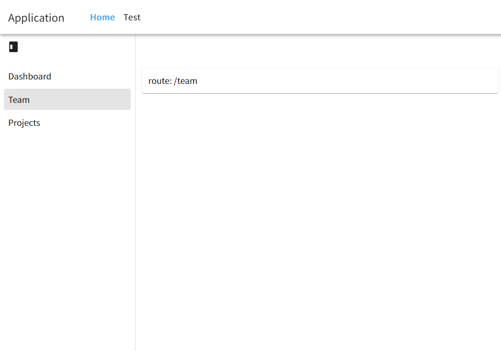

# 概要

Nuxt3 で Vuetify を使ってナビゲーションバーを実装するサンプルリポジトリです。



主な特徴
- Nuxt の layouts を利用して、リンクを配置したナビゲーションバーを実装している。
- あるページにナビゲーションドロワーを設置し、その中でのページ遷移を実装している。
- Vuetify を利用している。

# サンプル

https://stackblitz.com/~/github.com/johns-children/nuxt3-vuetify-navigation-example

# 使用技術

- Nuxt3
- Vue3
- Vuetify

# ディレクトリ構造

Nuxt3 のシステムに従っています。https://nuxt.com/docs/guide/directory-structure/app

## `/pages`

1. `index.vue`
  - Home ページです。ナビゲーションドロワーとコンテンツがある。
2. `text.vue`
  - 適当なテストページ。

## `/layouts`
1. `default.vue`
  - ナビゲーションバーとコンテンツがある。

---

# Nuxt 3 Minimal Starter

Look at the [Nuxt 3 documentation](https://nuxt.com/docs/getting-started/introduction) to learn more.

## Setup

Make sure to install the dependencies:

```bash
# yarn
yarn install

# npm
npm install

# pnpm
pnpm install
```

## Development Server

Start the development server on http://localhost:3000

```bash
npm run dev
```

## Production

Build the application for production:

```bash
npm run build
```

Locally preview production build:

```bash
npm run preview
```

Check out the [deployment documentation](https://nuxt.com/docs/getting-started/deployment) for more information.
